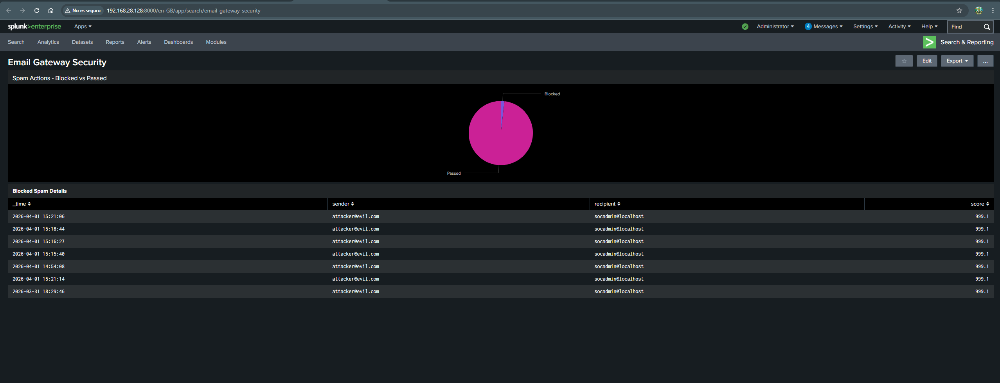
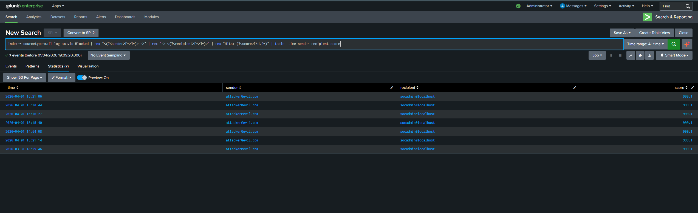

# Email Gateway Security Lab

## Overview

This lab is a security-focused email gateway I built on Ubuntu. The idea is simple — instead of letting emails go straight to the user, they first go through a security pipeline that checks if they are spam or malware. If something looks bad, it gets blocked and quarantined. Everything gets logged and sent to Splunk so I can monitor and alert on suspicious activity.

I built this to practice SOC skills and understand how email-based attacks like phishing are detected and blocked in real environments.

## Tools Used

| Tool | Role |
|------|------|
| Postfix | Receives incoming emails and routes them through the security pipeline |
| Amavis | Works as the middleman — takes the email from Postfix and sends it to SpamAssassin and ClamAV for analysis |
| SpamAssassin | Checks the email content and gives it a spam score — anything above 5.0 gets flagged |
| ClamAV | Scans for malware and viruses in the email and attachments |
| Splunk | Collects all the mail logs, shows detections in a dashboard, and fires alerts in real time |

## How the Email Flow Works

1. An email comes in and Postfix receives it on port 25
2. Instead of delivering it directly, Postfix sends it to Amavis on port 10024
3. Amavis passes it to SpamAssassin and ClamAV at the same time
4. SpamAssassin scores the email based on its content and headers
5. ClamAV scans for known malware signatures
6. If either one flags it, Amavis blocks the email and puts it in quarantine
7. The result gets logged to /var/log/mail.log and Splunk picks it up in real time

## Detection Testing

### Spam Test — GTUBE
The GTUBE string is the industry standard for testing spam detection — similar to how EICAR is used for antivirus. Any properly configured SpamAssassin must detect it.

I sent a test email through SMTP containing the GTUBE string and SpamAssassin flagged it with a score of 999.1. Amavis blocked it and quarantined it.

### Automated Test Script
Instead of typing all the SMTP commands manually every time, I wrote a Bash script to automate the spam test:
```bash
#!/bin/bash
(
echo "EHLO test.local"
sleep 1
echo "MAIL FROM:"
sleep 1
echo "RCPT TO:"
sleep 1
echo "DATA"
sleep 1
echo "Subject: Spam Test"
echo "From: attacker@evil.com"
echo "To: socadmin@localhost"
echo ""
echo "XJS*C4JDBQADN1.NSBN3*2IDNEN*GTUBE-STANDARD-ANTI-UBE-TEST-EMAIL*C.34X"
echo "."
sleep 1
echo "QUIT"
) | telnet localhost 25
```

## Splunk Integration

I configured Splunk to monitor /var/log/mail.log in real time. As emails get processed, the logs flow into Splunk automatically.

### Dashboard
I built a dashboard called Email Gateway Security with two panels:



- **Spam Actions — Blocked vs Passed** — pie chart showing how many emails were blocked vs delivered
- **Blocked Spam Details** — table showing the sender, recipient, and spam score for every blocked email



### Alert
I set up a real-time alert that triggers whenever a Blocked event is detected. Severity is set to High.

### SPL Queries

Blocked spam with details:
```
index=* sourcetype=mail_log amavis Blocked
| rex "<(?<sender>[^>]+)> ->"
| rex "-> <(?<recipient>[^>]+)>"
| rex "Hits: (?<score>[\d.]+)"
| table _time sender recipient score
```

Blocked vs Passed summary:
```
index=* sourcetype=mail_log amavis
| eval action=if(match(_raw,"Blocked"),"Blocked","Passed")
| stats count by action
```

## MITRE ATT&CK Mapping

| Technique | ID | How It's Detected |
|-----------|-----|-------------------|
| Phishing | T1566 | SpamAssassin scores the email content, Amavis blocks and quarantines it, Splunk alerts in real time |

## Environment

- OS: Ubuntu 22.04 LTS
- SIEM: Splunk Enterprise 10.2
- VM: VMware Workstation
